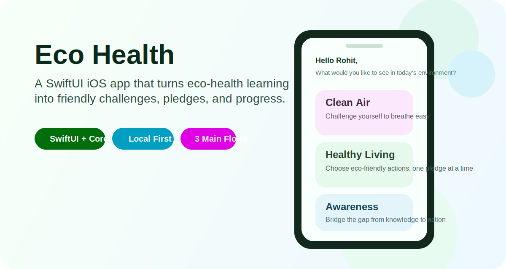
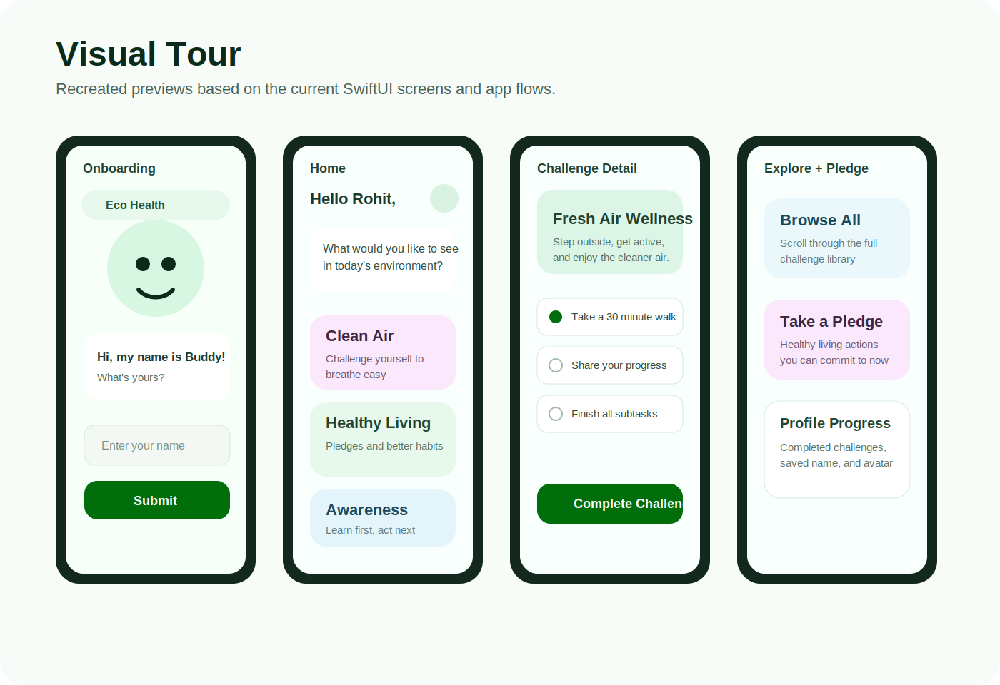

# Eco Health

  

Eco Health is a SwiftUI iOS app that turns eco-health education into approachable action. The experience combines clean-air challenges, healthy-living pledges, and environmental awareness content in a friendly, visual interface designed to feel lightweight, encouraging, and easy to explore.

## What Was Created

- A guided onboarding flow with profile personalization and a friendly mascot-led introduction.
- A category-based home experience for Clean Air, Healthy Living, and Awareness content.
- Challenge browsing flows for category lists, full-library exploration, and pledge-oriented actions.
- Detailed challenge screens with subtasks, completion tracking, and sharing support.
- Local-first persistence with Core Data and seeded content for offline-friendly use.
- A polished SwiftUI presentation layer with custom cards, themed backgrounds, Lottie/GIF motion, and a custom tab bar.
- A cleaned-up repo foundation with tests, CI, and safer Firebase config handling.

## Visual Tour

  

The gallery above uses recreated previews based on the current app UI and flow structure, since the repository did not include export-ready screenshots.

## Product Snapshot

### Core flows

- **Onboarding:** users enter a name, receive a profile avatar, and get routed into the main app experience.
- **Home:** a category landing page introduces the app's three content pillars and routes into challenges.
- **Challenges:** each category opens into a browsable list of active challenges with clear visual grouping.
- **Challenge detail:** users can read the context, work through subtasks, mark completion, and share progress.
- **Explore:** a browse-all view surfaces the full challenge library in a more discovery-oriented layout.
- **Pledge:** a lighter commitment flow focuses on healthy, eco-friendly actions users can take right away.
- **Profile:** the app stores the user's name, avatar, and completed challenges for a simple sense of progress.

### Built with

- **UI:** SwiftUI
- **Persistence:** Core Data
- **Media:** SDWebImageSwiftUI, Lottie, FLAnimatedImage
- **Services:** Firebase / Crashlytics
- **Testing:** XCTest
- **Automation:** GitHub Actions CI

## Project Highlights

- The content model is local-first, with seeded modules, categories, challenges, and subtasks.
- The app emphasizes approachable environmental action instead of overwhelming users with dense information.
- The interface leans into bright colors, rounded cards, illustrated motion, and a playful visual tone.
- Recent cleanup work improved list stability, save/error handling, onboarding reliability, test coverage, and CI readiness.

## Repo Notes

- `GoogleService-Info.plist` is intentionally not tracked in git.
- The repository now includes an initial XCTest target and a GitHub Actions iOS CI workflow.
- To run the app locally, add your own Firebase plist to `eco-buddy-ios/GoogleService-Info.plist`.
